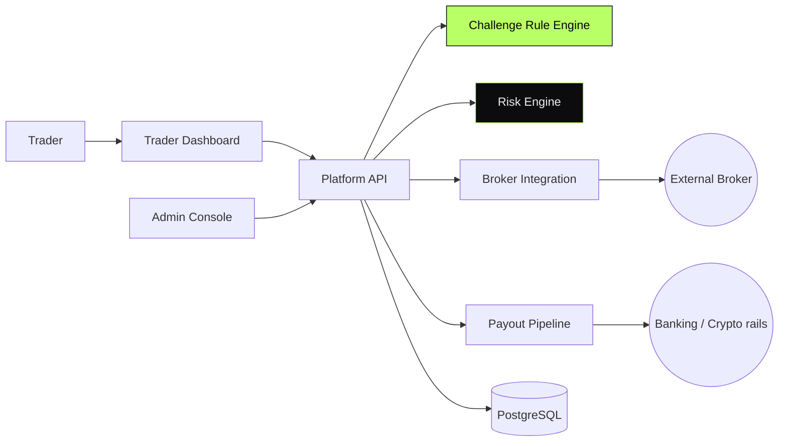

<div align="center">

```
   ██████╗ ██████╗  ██████╗ ██████╗
   ██╔══██╗██╔══██╗██╔═══██╗██╔══██╗
   ██████╔╝██████╔╝██║   ██║██████╔╝
   ██╔═══╝ ██╔══██╗██║   ██║██╔═══╝
   ██║     ██║  ██║╚██████╔╝██║
   ╚═╝     ╚═╝  ╚═╝ ╚═════╝ ╚═╝
```

# Prop Trading Platform

#### Internal proprietary-trading platform.
#### Challenge flow · broker integration · risk engine · payout pipeline.

[](#)
[](#)
[](#)
[](#)

</div>

---

> **TL;DR** — A prop-trading platform I led: the system that decides who
> earns funded status, how they trade, and how they get paid.

---

## Overview

A proprietary-trading platform: traders enroll, pass a challenge, get funded,
trade through an integrated broker, and receive payouts based on a defined
profit-share model.

The platform spans a challenge flow, broker integration, risk engine,
payout pipeline, an admin console, and a participant dashboard.

> This repository documents the system at the **architectural level**.
> Implementation code is private.

---

## My Role

> **Lead Engineer.** End-to-end ownership.

- Architecture and service decomposition
- Challenge flow and rule engine
- Broker API integration
- Risk engine — daily loss limits, drawdown, leverage caps
- Payout pipeline
- Admin tooling

---

## Architecture



---

## Capabilities

- **Challenge flow** — multi-phase rules with configurable targets
- **Broker integration** — order routing and position sync
- **Risk engine** — daily loss, drawdown, leverage and instrument caps
- **Payout pipeline** — calculate, schedule, pay, reconcile
- **Admin console** — overrides, audit, dispute resolution

---

## Architectural Decisions & Tradeoffs

### 1. Rule engine as configuration

Challenge rules are **data, not code**. A new challenge variant ships
without a release.

### 2. Risk engine has veto authority

Every order passes the risk engine. Override path exists, but it audits.

### 3. Payouts are reconciled, not assumed

After a payout is dispatched, the system **reconciles** what actually
landed against what was promised. Mismatches page operators.

---

## Engineering Invariants

- **Never** allow an order that violates risk
- **Never** dispatch a payout without reconciliation
- **Never** mutate participant state outside an audited path
- **Never** depend on broker ack as final truth — confirm with reads

---

## Related Public Documents

- [`market-making-infra`](https://github.com/eldardzh/market-making-infra) — adjacent trading systems
- [`trading-systems-toolkit`](https://github.com/eldardzh/trading-systems-toolkit) — simulator / backtest tooling

---

<div align="center">

#### **Contact**
[**eldardzh.com**](https://eldardzh.com) · [**@EldarDissmay**](https://x.com/EldarDissmay) · **dissmay21@gmail.com**

<sub>© 2026 · Eldar D.</sub>

</div>
